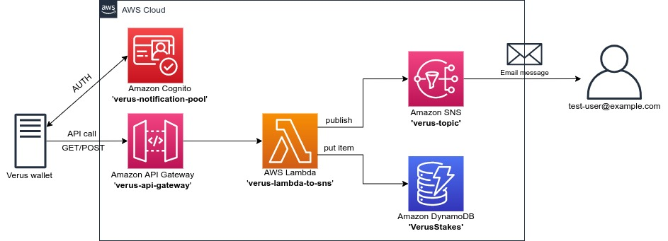

# Verus stake notification

[](https://www.python.org/downloads/release/python-377/)
[](https://boto3.amazonaws.com/v1/documentation/api/latest/index.html)
[](https://lbesson.mit-license.org/)

> The **Verus stake notification** is an application that monitors the state of your **Verus Coin (VRSC)** cryptocurrency wallet.
> If you "win the block", the application will inform you of a staking reward (new stake) that have appeared in your Verus CLI wallet.

> :warning: **Note**: Bulding AWS infrastructure for **Verus stake notification** app with `boto3` package is **no longer maintained**, at this moment it is recommended to use Terraform tool (branch `main`).

> :bulb: It is well known that using `boto3` to build the AWS infrastructure can be tricky and there are dedicated tools for that, but it has been used only for self-education purposes.

## Features
* The project uses Python script and AWS services to notify the user about the new staking reward (stake) in the VRSC wallet.
* In this branch the `boto3` AWS SDK for Python is used to build and destroy dedicated environment in the AWS Cloud.
* The `check_new_stake.py` script can be run at regular intervals on the machine running the VRSC wallet (with cronjob or systemd timer). If a new stake arrives, the script calls the **API Gateway** in AWS Cloud.
* When the **API Gateway** URL is invoked, the created AWS resources will send email notification to a selected address.
* Orphan stakes and new transactions (transferring cryptocurrency from/to wallet) are not counted.
* The email address that will be notified about new stake is stored in `.env` file (`EMAIL_TO_NOTIFY`).
* The new stake is also added to the **Amazon DynamoDB** table (with timestamp and stake value).
* Access to **API Gateway** is authorized with **Amazon Cognito**.
* Additionally, access to the **API Gateway** can also be limited to a selected ip address (VRSC wallet public ip address):
  - To limit access to specific public ip address - set `WALLET_PUBLIC_IP='your-public-ip-address'` in `.env` file;
  - To leave the API Gateway open to the public - set `WALLET_PUBLIC_IP=''` in `.env` file.
* The **API Gateway** URL and **Amazon Cognito** data are added to `new_stake_script/.env-api` file during AWS environment build.
* Data stored in `new_stake_script/.env-api` file are used by the `check_new_stake.py` script when it detects a new stake.
* The script `check_new_stake.py` saves its logs in a `new_stake_script/stake.log` file.

## Project architecture


## Getting Started

Below instructions will get you a copy of the project running on your local machine.

### Requirements
Python third party packages:
* [Boto3](https://boto3.amazonaws.com/v1/documentation/api/latest/index.html)
* [python-dotenv](https://pypi.org/project/python-dotenv/)
* [pytest](https://docs.pytest.org/en/6.2.x/)
* [psutil](https://pypi.org/project/psutil/)
* [requests](https://docs.python-requests.org/en/master/)

Other prerequisites:
* The **Verus Coin (VRSC) CLI wallet** running on some Linux distribution. You can find appropriate wallet binaries on Verus Coin (VRSC) project website - [Verus wallet](https://verus.io/wallet/command-wallet).
* The AWS account.  
* Before using scripts, you need to set up authentication credentials for your AWS account (with programmatic access) using either the IAM Management Console or the [AWS CLI](https://docs.aws.amazon.com/cli/latest/userguide/install-cliv2-linux.html) tool.
* The `virtualenv` package already installed on the OS level.

## Build and run the application

The project creation process is divided into two phases:
1. Deployment of the AWS resources (infrastructure) with `boto3` package.
2. Setup script for monitoring the VRSC wallet.
> :warning: **Note:** It is recommended to build the AWS infrastructure on a different host than the one running the VRSC wallet (fe. your localhost). 

In both phases we will use the `virtualenv` tool to build the application.

1. Clone git repository to user home directory and enter `verus-stake-notification` directory.
   ```bash
   $ git clone https://github.com/luk-kop/verus-stake-notification.git
   $ cd verus-stake-notification/
   ```

2. On the infrastructure building host run following commands in order to create virtual environment and install the required packages.
    ```bash
    $ virtualenv venv
    # or 
    $ python3 -m venv venv
    $ source venv/bin/activate
    (venv) $ pip install -r requirements.txt
    ```

3. Before running the application you should create `.env` file in the root application directory (`verus-stake-notification`).
   The best solution is to copy the existing example file `.env-example` and edit the necessary data.
    ```bash
    (venv) $ cp .env-example .env
    ```
   
4. Build the AWS resources - deployment with `boto3` package:
    ```bash
    (venv) $ python boto3_resources.py build
    # deactivate virtual environment after infrastructure deployment
    (venv) $ deactivate
    ```
5. Once the AWS resources are properly deployed, you should copy `new_stake_script` directory to the host where VRSC wallet is running.
    ```bash
    # example of a copying a dictionary to remote host using the rsync tool 
    $ rsync -avzP new_stake_script/ user@your-vrsc-wallet-host:~/new_stake_script/
    ```
   > :warning: **Note:** After setting up the AWS resources correctly and copying the `new_stake_script` directory to the host with the VRSC wallet running, for testing purposes you can get **Cognito Access Token** and make a test call to the API Gateway with `get_cognito_token.sh`.
6. On the host with running VRSC wallet run following commands in order to create virtual environment and install the required packages.
    ```bash
    $ cd ~/new_stake_script/
    $ virtualenv venv
    # or 
    $ python3 -m venv venv
    $ source venv/bin/activate
    (venv) $ pip install -r requirements-script.txt
    ```

7. Add a cronjob on the host with the running VRSC wallet to check the status of the wallet every 20 minutes.
   ```bash
    (venv) $ crontab -e
    ```
   Add below line to `crontab` (please change your username accordingly):
   ```bash
   */20 * * * * /home/user/new_stake_script/venv/bin/python /home/user/new_stake_script/check_new_stake.py
   ```

7. To remove all project's AWS resources with `boto3` package use below command. Remember to activate virtual environment before run commands (should be issued on the host from which you built the infrastructure).
    ```bash
    (venv) $ python aws_environment.py destroy
    ```