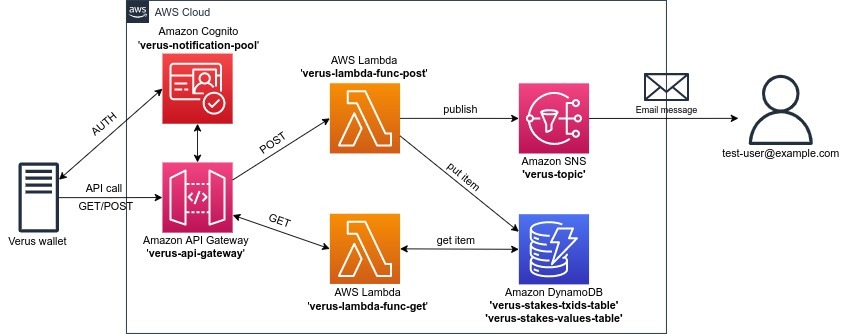

# Verus stake notification

[](https://www.python.org/downloads/release/python-377/)
[](https://boto3.amazonaws.com/v1/documentation/api/latest/index.html)
[](https://www.terraform.io/)
[](https://lbesson.mit-license.org/)

> The **Verus stake notification** is an application that monitors the state of your **Verus Coin (VRSC)** cryptocurrency wallet.
> If you "win the block", the application will inform you of a staking reward (new stake) that have appeared in your Verus CLI wallet.

## Features
* The project uses Python script and AWS services to notify the user about the new staking reward (stake) in the VRSC wallet.
* The `Terraform` tool is used to build and destroy dedicated environment in the AWS Cloud.
* The Amazon S3 bucket and DynamoDB table are used as backend for `Terraform` **remote state file**.
* The `check_new_stake.py` script can be run at regular intervals on the host running the VRSC wallet (with cronjob or systemd timer). If a new stake arrives, the script calls the **API Gateway** in AWS Cloud (with POST method).
* When the **API Gateway** URL is invoked:
  - the AWS resources will send email notification to a selected address;
  - information about new stake are added to the **Amazon DynamoDB** tables.
* Orphan stakes and new transactions (transferring cryptocurrency from/to wallet) are not counted.
* The email address that will be notified about new stake is stored in `.env` file (`EMAIL_TO_NOTIFY`).
* In **Amazon DynamoDB** stakes data is stored in two tables:
  - `verus_stakes_txids_table` - information about each stake (stake transaction id, stake value, stake timestamp);
  - `verus_stakes_values_table` - information about the value and number of stakes for a given period of time (year and month).
* Access to **API Gateway** is authorized with **Amazon Cognito**.
* Additionally, access to the **API Gateway** can also be limited to a selected ip address (VRSC wallet public ip address):
  - To limit access to specific public ip address - set `WALLET_PUBLIC_IP='your-public-ip-address'` in `.env` file;
  - To leave the API Gateway open to the public - set `WALLET_PUBLIC_IP=''` in `.env` file.
* The **API Gateway** URL and **Amazon Cognito** data are added to `new_stake_script/.env-api` file during AWS environment build.
* Data stored in `new_stake_script/.env-api` file are used by the `check_new_stake.py` script when it detects a new stake.
* The script `check_new_stake.py` saves its logs in a `new_stake_script/stake.log` file.
* Two additional scripts are included in the `new_stake_script` folder:
  - Python script `call_aws_api.py` - call API Gateway with GET and POST methods;
  - Bash script `call_aws_cognito_api.sh` - get Amazon Cognito token and call API Gateway with GET method.

## Project architecture


## Getting Started

Below instructions will get you a copy of the project running on your local host.

### Requirements
Python third party packages:
* [Boto3](https://boto3.amazonaws.com/v1/documentation/api/latest/index.html)
* [python-dotenv](https://pypi.org/project/python-dotenv/)
* [pytest](https://docs.pytest.org/en/6.2.x/)
* [psutil](https://pypi.org/project/psutil/)
* [requests](https://docs.python-requests.org/en/master/)

Other prerequisites:
* The **Verus Coin (VRSC) CLI wallet** running on some Linux distribution. You can find appropriate wallet binaries on Verus Coin (VRSC) project website - [Verus wallet](https://verus.io/wallet/command-wallet).
* The AWS account.  
* Before using scripts, you need to set up authentication credentials for your AWS account (with programmatic access) using either the IAM Management Console or the [AWS CLI](https://docs.aws.amazon.com/cli/latest/userguide/install-cliv2-linux.html) tool.
* The [Terraform](https://learn.hashicorp.com/tutorials/terraform/install-cli) tool must be installed in order to successfully deploy the AWS resources using it.
* Remote `Terraform` state file backend with Amazon S3 and DynamoDB services. 
* The `virtualenv` package already installed on the OS level.

## Build and run the application

The project creation process is divided into two phases:
1. Deployment of the AWS resources (infrastructure) with `Terraform` tool.
2. Setup script for monitoring the VRSC wallet.
> :warning: **Note:** It is recommended to build the AWS infrastructure on a different host than the one running the VRSC wallet (fe. your localhost) . 

In both phases we will use the `virtualenv` tool to build the application.

1. Clone git repository to user home directory and enter `verus-stake-notification` directory.
   ```bash
   $ git clone https://github.com/luk-kop/verus-stake-notification.git
   $ cd verus-stake-notification/
   ```

2. On the infrastructure building host run following commands in order to create virtual environment and install the required packages.
    ```bash
    $ virtualenv venv
    # or 
    $ python3 -m venv venv
    $ source venv/bin/activate
    (venv) $ pip install -r requirements.txt
    ```

3. Before running the application you should:
    - create `.env` file in the root application directory (`verus-stake-notification`). The best solution is to copy the existing example file `.env-example` and edit the necessary data.
    ```bash
    (venv) $ cp .env-example .env
    ```
    - create `backend.hcl` file (`Terraform` remote state configuration) inside `terraform_files` dir. Copy example file and edit necessary data.
    ```bash
    (venv) $ cd terraform_files/
    (venv) $ cp backend-example.hcl backend.hcl
   ```    
   
4. To build the AWS resources with `Terraform` tool use `terraform_resources.py` script.
    Before running `terraform_resources.py` state remote state file backend configuration.    
    

    #### Script `terraform_resources.py` usage:   
    ```bash
    usage: terraform_resources.py [-h] [--region REGION] [--profile PROFILE] {init,build,destroy} ...

    The script deploys AWS resources with terraform

    optional arguments:
      -h, --help            show this help message and exit
      --region REGION       AWS region in which resources will be deployed (default: eu-west-1)
      --profile PROFILE     AWS profile used to deploy resources (default: default)
    
    Valid actions:
      {init,build,destroy}
        init                Initialize Terraform working directory
        build               Build AWS environment
        destroy             Remove already created AWS environment
    ```
   Run following commands to build the AWS resources:
   > :bulb: **Note:** The first time you run the `python terraform_resources.py build` command, the Terraform working directory will be initialized.
   ```bash
    (venv) $ python terraform_resources.py build
    # For more options use:
    (venv) $ python terraform_resources.py -h
    # deactivate virtual environment after infrastructure deployment
    (venv) $ deactivate
   ```

5. Once the AWS resources are properly deployed, you should copy `new_stake_script` directory to the host where the VRSC wallet is running.
    ```bash
    # example of a copying a dictionary to remote host using the rsync tool 
    $ rsync -avzP new_stake_script/ user@your-vrsc-wallet-host:~/new_stake_script/
    ```
   > :warning: **Note:** After setting up the AWS resources correctly and copying the `new_stake_script` directory to the host with the VRSC wallet running, for testing purposes you can get **Cognito Access Token** and make a test call to the API Gateway with `get_cognito_token.sh`.
6. On the host with running VRSC wallet run following commands in order to create virtual environment and install the required packages.
    ```bash
    $ cd ~/new_stake_script/
    $ virtualenv venv
    # or 
    $ python3 -m venv venv
    $ source venv/bin/activate
    (venv) $ pip install -r requirements-script.txt
    ```

7. Add a cronjob on the host with the running VRSC wallet to check the status of the wallet every 20 minutes.
   ```bash
    (venv) $ crontab -e
    ```
   Add below line to `crontab` (please change your username accordingly):
   ```bash
   */20 * * * * /home/user/new_stake_script/venv/bin/python /home/user/new_stake_script/check_new_stake.py
   ```

7. To remove all project's AWS resources with `Terraform` tool use below command. Remember to activate virtual environment before run commands (should be issued on the host from which you built the infrastructure).
    ```bash
    (venv) $ python terraform_resources.py destroy
    ```
     
## Run additional scripts

- Extra scripts should be run on the host where the VRSC wallet is running and after the AWS resources deployment.
- Scripts should be run from `new_stake_script` directory.

#### Script `call_aws_api.py` usage:
```bash
(venv) $ cd new_stake_script/
(venv) $ python call_aws_api.py
usage: call_aws_api.py [-h] {get,post} ...

The verus-notification API Gateway calling script

optional arguments:
  -h, --help  show this help message and exit

Valid HTTP methods:
  {get,post}
    get       get value of VRSC stakes in selected time period
    post      post new VRSC stake with specified value

"post" method usage: call_aws_api.py get [-h] [-d DATE]

optional arguments:
  -h, --help            show this help message and exit
  -d DATE, --date DATE  year or month of year (default: 2022-01)

"get" method usage: call_aws_api.py post [-h] [-v VALUE]

optional arguments:
  -h, --help            show this help message and exit
  -v VALUE, --value VALUE
                        stake value (default: 12.0)
```
You can use the `call_aws_api.py` script using one of the following commands:
```bash
# Run script with 'get' and default option (current month).
python call_aws_api.py get
# You should get the similar output:
{'statusCode': 200, 'body': '{"timeframe": "2022-01", "stakes_count": 0, "stakes_amount": 0}'}
# or
{'statusCode': 200, 'body': '{"timeframe": "2022-01", "stakes_count": 3.0, "stakes_amount": 124.0}'}

# Run script with 'get' and the specified date (year 2022).
python call_aws_api.py get --date 2022
# You should get the similar output:
{'statusCode': 200, 'body': '{"timeframe": "2022", "stakes_count": 4.0, "stakes_amount": 136.0}'}

# Run script with 'get' and the specified date (December 2021).
python call_aws_api.py get --date 2021-12
# You should get the similar output:
{'statusCode': 200, 'body': '{"timeframe": "2021-12", "stakes_count": 0, "stakes_amount": 0}'}

# Run script with 'post' and default option (stake value = 12 VRSC).
python call_aws_api.py post
# You should get the similar output:
{'statusCode': 200, 'body': '"Tables updated and notification sent!"'}

# Run script with 'post' and stake value = 100 VRSC.
python call_aws_api.py post --value 100
# You should get the similar output:
{'statusCode': 200, 'body': '"Tables updated and notification sent!"'}
```

#### Script `call_aws_cognito_api.sh` usage:
```bash
(venv) $ cd new_stake_script/
(venv) $ ./call_aws_cognito_api.sh
   ________                                         __  _
  / ____/ /_  ____  ____  ________     ____  ____  / /_(_)___  ____
 / /   / __ \/ __ \/ __ \/ ___/ _ \   / __ \/ __ \/ __/ / __ \/ __ \
/ /___/ / / / /_/ / /_/ (__  )  __/  / /_/ / /_/ / /_/ / /_/ / / / /
\____/_/ /_/\____/\____/____/\___/   \____/ .___/\__/_/\____/_/ /_/
                                         /_/

1. Get Cognito Access Token
2. Get Cognito Access Token and call API Gateway with GET method
>>>
```